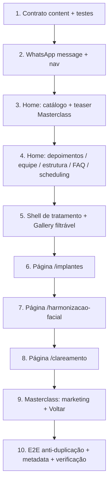

# Plan: Landing — especialidades e páginas de conversão

Referência: [`spec.md`](./spec.md) — **aprovada** em 2026-08-13.

Branch: `feat/landing-especialidades` (criada a partir de `main`).

**Gate:** Plan ✅ (2026-08-13) → TASKS → (humano aprova) → IMPLEMENT.

---

## Visão geral

Evoluir a landing unificada em fatias verticais TDD: primeiro o **contrato de conteúdo**, depois a **home mesclada** (catálogo + prova social + FAQ + WhatsApp-first), depois as **3 páginas de tratamento** com shell compartilhado, por último a **Masterclass limpa** (marketing + Voltar + form intacto).

Nada de CMS, Prisma, pixels ou redesign de tokens.



---

## Ordem e paralelismo

| Fase | Sequencial? | Pode paralelizar | Checkpoint |
|------|-------------|------------------|----------|
| 1 Content contract | Sim (base) | — | `npm test` — 12 especialidades, sem Pediatria, nav nova |
| 2 WhatsApp + nav | Após 1 | — | Header usa `Link`; WhatsApp aceita `message` |
| 3 Catálogo home | Após 2 | — | E2E: 12 nomes + 3 hrefs + teaser Masterclass |
| 4 Restante da home | Após 3 | depoimentos / equipe / FAQ / about / scheduling em fatias TDD | Home na ordem da spec; Pediatria ausente |
| 5 Shell tratamento | Após 4 | — | Gallery aceita `items` filtrados; Testimonials reutilizável |
| 6–8 Páginas | Após 5 | 6→7→8 em série (mesmo shell; copy diferente) | Cada rota E2E verde antes da próxima |
| 9 Masterclass | Após 5 (pode em paralelo com 6–8 se o shell não conflitar) | Preferir **depois** de 6–8 para não misturar chrome | Voltar + seções + form; sem nav da clínica |
| 10 Hardening | Final | — | `npm test && npm run test:e2e && npm run lint && npm run build` |

**TDD vertical:** um comportamento da spec → teste RED → implementação mínima → GREEN → próxima fatia. Não escrever todos os E2E de uma vez.

**Estado sempre entregável:** depois de cada fase a home existente continua buildando; páginas novas só entram quando o teste daquela rota passa.

---

## Decisões de implementação (para o Plan)

Estas não estavam no código; o Plan trava o “como”. Corrija se discordar.

1. **FAQ sem dependência nova.** Usar `<details>` / `<summary>` estilizados com tokens existentes (`border`, `font-display`, `text-muted-foreground`). Sem `npx shadcn add accordion`. Se a UX do Accordion for exigida depois, aí sim perguntar (boundary da spec).
2. **`WhatsAppButton` ganha `message?: string`** e encaminha para `getWhatsAppUrl(message)` (já existe). Hoje o botão ignora mensagem customizada — sem isso os CTAs de tratamento/especialidade ficam genéricos.
3. **Header/nav usam `next/link`.** Itens hash viram `href="/#servicos"` etc., para funcionarem nas páginas internas. Item Masterclass continua `/masterclass`.
4. **Gallery vira componente burro:** `items` por prop (default = galeria completa da home). Páginas de tratamento passam subset por `treatment` no content.
5. **Testimonials** = um componente (`components/sections/testimonials.tsx`) + `content/testimonials.ts`. Home e as 3 páginas importam o mesmo array. Sem variant de copy.
6. **Shell de tratamento** (`components/treatments/treatment-page.tsx`): Header + `<main>` + Footer + FAB WhatsApp. Páginas só montam blocos. Masterclass **não** usa este shell.
7. **`site.ts` emagrece:** tira `highlights` (vira `specialties.ts`) e `gallery` (fica em `content/gallery.ts` com `treatment?`). Nav nova no próprio `site.ts`.
8. **Teaser Masterclass** = faixa única imediatamente **após** o catálogo, ainda dentro da seção `#servicos` ou como sibling com `id` próprio — uma ocorrência, CTA “Conhecer a Masterclass”.
9. **Copy de depoimentos:** 2–3 rascunhos curtos em primeira pessoa, **sem sobrenome**, marcados em comentário `// REVIEW` no arquivo. Cliente troca no staging.
10. **Promo clareamento:** `promo: { priceLabel: "R$ 1.200", ... } | null`. Neste ciclo, objeto preenchido. Render condicional.

---

## Componentes e dependências

```mermaid
flowchart LR
  subgraph content [content/]
    site[site.ts]
    spec[specialties.ts]
    gal[gallery.ts]
    tes[testimonials.ts]
    faq[faq.ts]
    clinic[clinic.ts]
    imp[treatments/implantes.ts]
    har[treatments/harmonizacao.ts]
    cla[treatments/clareamento.ts]
    mc[masterclass.ts]
  end

  subgraph home [Home /]
    Hero --> TrustBar --> Services
    Services --> Gallery
    Gallery --> Testimonials
    Testimonials --> Team
    Team --> About
    About --> Faq
    Faq --> Scheduling
    Scheduling --> Location --> Cta
  end

  subgraph tx [Páginas tratamento]
    Shell[TreatmentPage shell]
    Shell --> ImpPage[/implantes]
    Shell --> HarPage[/harmonizacao-facial]
    Shell --> ClaPage[/clareamento]
  end

  spec --> Services
  gal --> Gallery
  tes --> Testimonials
  tes --> tx
  faq --> Faq
  faq --> HarPage
  clinic --> Team
  clinic --> About
  imp --> ImpPage
  har --> HarPage
  cla --> ClaPage
  mc --> Master[/masterclass]
```

### Reuso vs novo

| Peça | Ação |
|------|------|
| Hero, TrustBar, Location, Cta | Manter; Cta já tem WhatsApp — só garantir evidência (ordem/label), sem nova seção |
| Services | Reescrever: 3 destaques com mídia + 9 compactos + teaser Masterclass |
| Gallery | Extrair dados; aceitar `items` |
| About | Recentrar em estrutura (logo + hero); tirar bio longa (vai para Team) |
| Scheduling | WhatsApp-first; agenda.link secundário; mesmos 3 passos podem ficar no bloco online |
| Header / Footer | Nav nova; Footer pode listar âncoras extras (equipe, FAQ) sem lotar o header |
| WhatsAppButton / FAB | Estender `message`; FAB da home permanece genérico |
| InterestForm / actions / obrigado | **Não tocar** em comportamento |
| Logo | Reusar na Masterclass |

### Novos arquivos (alvo)

```
content/specialties.ts
content/gallery.ts
content/testimonials.ts
content/faq.ts
content/clinic.ts
content/treatments/implantes.ts
content/treatments/harmonizacao.ts
content/treatments/clareamento.ts
content/masterclass.ts
content/specialties.test.ts          # ordem das 12 + sem Pediatria + hrefs
content/site.test.ts                 # nav atualizada (já existe)

components/sections/testimonials.tsx
components/sections/team.tsx
components/sections/faq.tsx
components/sections/masterclass-teaser.tsx
components/treatments/treatment-page.tsx
components/treatments/treatment-hero.tsx
components/layout/back-link.tsx      # Voltar da Masterclass (e reuso possível)

app/implantes/page.tsx
app/harmonizacao-facial/page.tsx
app/clareamento/page.tsx

e2e/specialty-pages.spec.ts
```

Arquivos existentes que mudam (não mais que o necessário por fatia): `app/page.tsx`, `app/layout.tsx` (keywords), `app/masterclass/page.tsx`, `content/site.ts`, `components/layout/header.tsx`, `components/layout/footer.tsx`, `components/sections/services.tsx`, `about.tsx`, `gallery.tsx`, `scheduling.tsx`, `components/ui/whatsapp-button.tsx`, `e2e/home.spec.ts`, `e2e/masterclass.spec.ts`, `e2e/nav-masterclass.spec.ts`.

---

## Fases

### 1. Contrato de conteúdo + testes

**O quê:** criar os módulos `content/*` com tipos e dados. Home ainda usa `siteConfig.highlights` até a fase 3 (ou migrar Services na 3). Testes de contrato falham/passam **só nos novos arquivos**.

**Inclui:**
- 12 especialidades na ordem da spec; `href` só nos 3 destaques; `whatsappMessage` em todas.
- Gallery items atuais + campo `treatment?: "implantes" | "harmonizacao" | "clareamento"`.
- FAQ home (6 perguntas) + `harmonizacaoFaq` (3–5).
- Equipe: array com 1 item (Dra. Jady).
- Implantes: blocos + `payment: "Até 15x sem juros"`.
- Clareamento: claim 3 tons + `promo` R$ 1.200.
- Masterclass: learn / forWhom / teacher / differentials / certificate (rascunhos).
- Nav em `site.ts`: Especialidades, Resultados, Clínica, Agendamento, Masterclass.

**Testes (RED→GREEN nesta fase):**
- `specialties` tem length 12, labels na ordem, nenhum match `/pediatria/i`.
- Implantes/Clareamento/Harmonização têm os hrefs da spec.
- `siteConfig.nav` = os 5 itens locked.
- Implantes content contém “15x”; clareamento contém “3 tons” e “1.200” / “1200”.

**Risco:** baixo. **Mitigação:** não ligar os módulos na UI ainda, ou ligar só o que não quebra visual (nav). Preferência: **nav já na fase 2**; content files na 1.

**Verify:** `npm test`.

---

### 2. WhatsApp `message` + Header com `Link`

**O quê:**
- `WhatsAppButton`: prop `message?: string`.
- Header: `Link` do Next para cada item de `siteConfig.nav` (desktop + sheet). Fechar sheet no click (já faz).
- Teste unitário/UI do botão: href `wa.me` inclui o texto encodado quando `message` é passada.

**Risco:** baixo. Hash `/#servicos` no `Link` do Next funciona. **Mitigação:** E2E nav Masterclass já existente deve continuar verde.

**Verify:** `npm test` + `npm run test:e2e -- e2e/nav-masterclass.spec.ts`.

---

### 3. Home — catálogo + teaser Masterclass

**O quê:** reescrever `Services` contra `specialties.ts`.
- 3 cards com mídia (reusar assets atuais; “Botox” vira “Harmonização Facial”).
- 9 cards compactos (ícone Lucide + blurb + WhatsApp).
- Teaser Masterclass uma vez, CTA → `/masterclass`.
- Remover Pediatria da UI. Não apagar o mp4.

**Testes:**
- E2E home: visível cada uma das 12 labels.
- E2E: links Implantes / Harmonização / Clareamento com hrefs corretos.
- E2E: teaser ou link “Masterclass” / “Conhecer a Masterclass”.
- E2E: `getByText(/pediatria/i)` **não** visível na home.

**Risco:** médio — layout do grid 3+9. **Mitigação:** destaques em grid 3 colunas; compactos em grid 2/3/4; não forçar 12 cards iguais com vídeo.

**Verify:** `npm run test:e2e -- e2e/home.spec.ts` (estendido) + visual rápido no `npm run dev`.

---

### 4. Home — prova social, equipe, estrutura, FAQ, scheduling

Ordem de montagem em `app/page.tsx` (spec):

Hero → TrustBar → Services → Gallery → Testimonials → Team → About → Faq → Scheduling → Location → Cta

**Fatias internas (TDD):**
1. `Testimonials` + seção na home.
2. `Team` (Dra. Jady) + About recentrado (estrutura, imagens atuais). Não repetir o mesmo parágrafo longo nos dois.
3. `Faq` com `<details>` e as 6 perguntas.
4. `Scheduling` WhatsApp-first (botão WhatsApp em evidência; bloco online existente como secundário). FAB intacto.
5. Footer: âncoras Equipe/FAQ opcionais; Localização continua no footer.

**Risco:** página longa. **Mitigação:** paddings iguais às seções atuais (`py-20 sm:py-28`); FAQ compacto; equipe com um card só.

**Verify:** home renderiza as novas headings; `npm test` + E2E home estendido (depoimentos, FAQ, “15x” **não** precisa estar na home).

---

### 5. Shell de tratamento + Gallery filtrável

**O quê:**
- `Gallery` aceita `items` (default: todos).
- `TreatmentPage`: Header, main, Footer, FAB com `message` do tratamento.
- `TreatmentHero`: título, subtítulo, CTA WhatsApp.
- Helper `galleryByTreatment("implantes" | ...)` em `content/gallery.ts`.

**Risco:** baixo. Sem rotas novas ainda — só primitivos + teste de filtro (unit).

**Verify:** unit do filtro; `npm test`.

---

### 6. `/implantes`

**O quê:** `app/implantes/page.tsx` monta shell + blocos da spec (para quem é, como funciona, medo da cirurgia, gallery filtrada, **15x sem juros**, depoimentos iguais, CTA).

**Testes E2E:** heading Implantes; textos dos blocos; “15x”; WhatsApp; depoimentos; **não** tem “Venha nos visitar” / grid das 12 / Pediatria.

**Risco:** copy longo. **Mitigação:** tudo em `content/treatments/implantes.ts`; página só mapeia.

**Verify:** `npx playwright test e2e/specialty-pages.spec.ts` (primeiro describe).

---

### 7. `/harmonizacao-facial`

Mesmo shell. Blocos Botox / Preenchimento / Bioestimuladores / fotos (gallery `harmonizacao`) / FAQ específico (`harmonizacaoFaq`) / avaliação WhatsApp / depoimentos.

**E2E:** as três palavras-chave; FAQ da harmonização visível; FAQ genérico “convênio” da home **não** precisa aparecer aqui.

**Verify:** mesmo spec file, segundo describe.

---

### 8. `/clareamento`

Claim 3 tons; tipos; duração; quem pode; promo R$ 1.200 (ocultar se `promo === null`); gallery `clareamento`; depoimentos; CTA.

**E2E:** “3 tons”; “1.200” ou “R$ 1.200”; CTA.

**Verify:** terceiro describe.

---

### 9. Masterclass limpa + marketing + Voltar

**O quê:**
- `app/masterclass/page.tsx`: `BackLink` (“Voltar à clínica” → `/`) + Logo + seções de `content/masterclass.ts` + `InterestForm` inalterado.
- **Não** importar Header/Footer.
- `actions.ts` intocado.

**Testes:**
- Estender `e2e/masterclass.spec.ts`: Voltar com href `/`; seções (aprender / para quem / professora / certificado); form labels.
- Assert: `getByRole("link", { name: "Especialidades" })` **não** visível nesta página.
- E2E form/obrigado existentes continuam verdes.

**Risco:** médio — página cresce e o form desce. **Mitigação:** form continua no final, `max-w-xl` no form, seções de marketing `max-w-2xl` acima; não mudar campos.

**Verify:** `npm run test:e2e -- e2e/masterclass.spec.ts e2e/obrigado.spec.ts`.

---

### 10. Hardening

- `e2e/specialty-pages.spec.ts`: tabela anti-duplicação (as 3 URLs **não** mostram catálogo completo, equipe “A clínica” no sentido About, mapa iframe, teaser Masterclass).
- `app/layout.tsx`: keywords incluem as 12 áreas relevantes; tirar ênfase em pediatria se estiver como keyword principal (pode permanecer no array SEO se quiser — **preferir remover** para não contradizer o catálogo).
- `lib/design-contract.test.ts` continua passando.
- `npm run lint` + `npm run build`.

**Risco:** E2E flaky por texto compartilhado (“Odonto Solution”, “WhatsApp”). **Mitigação:** assertir headings/`id` de seção, não substrings genéricas.

**Verify:** checklist da spec Success Criteria.

---

## Riscos globais e mitigação

| Risco | Impacto | Mitigação |
|-------|---------|-----------|
| Copy clínico agressivo demais | Cliente/ética | Tom conservador; números só os locked; depoimentos sem sobrenome |
| Home longa demais | Bounce mobile | Seções no ritmo atual; FAQ `<details>` fechado por padrão |
| WhatsApp sem mensagem específica | Conversão fraca | Fase 2 obrigatória antes dos CTAs de tratamento |
| Duplicar seções sem querer | Spec violada | E2E anti-duplicação na fase 10; code review contra a merge table |
| Mexer no form/leads | Funil ads quebra | `actions.ts` e schema fora do diff; E2E obrigado/masterclass como guarda |
| Accordion shadcn “por costume” | Boundary | Plan trava `<details>`; nova dep só com “ask first” |
| Fotos de tratamento mal tagueadas | Página com caso errado | Tag explícita em `gallery.ts`; implante usa `reabilitacao-oral.jpg`; harmonização usa botox-* |

---

## Fora deste Plan (igual à spec)

- CMS, páginas das outras 9 especialidades, Pediatria, Prisma, EasyPanel, dark mode, Header na Masterclass.

---

## Verificação final (quando as Tasks estiverem feitas)

```bash
npm test
npm run test:e2e
npm run lint
npm run build
```

Critérios = Success Criteria da spec.

---

## O que o Plan *não* faz

- Não lista tasks atômicas (isso é a fase Tasks).
- Não escreve o copy final aqui — copy vive em `content/` na implementação.
- Não cria as rotas ainda.

---

## Pedido de revisão

O Plan está certo se você concorda com:

1. FAQ em `<details>` (sem Accordion shadcn).
2. `WhatsAppButton` com prop `message`.
3. Ordem 1→10 acima (Masterclass depois das 3 páginas).
4. Gallery/Testimonials como componentes reutilizáveis com dados injetados.
5. Masterclass sem Header/Footer, só Voltar + Logo + marketing + form.

Plan aprovado em 2026-08-13. Tasks em [`tasks.md`](./tasks.md).
